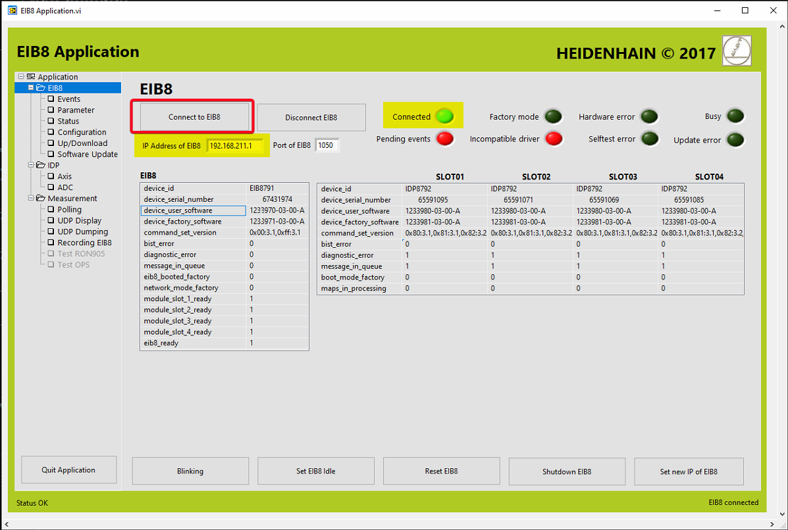
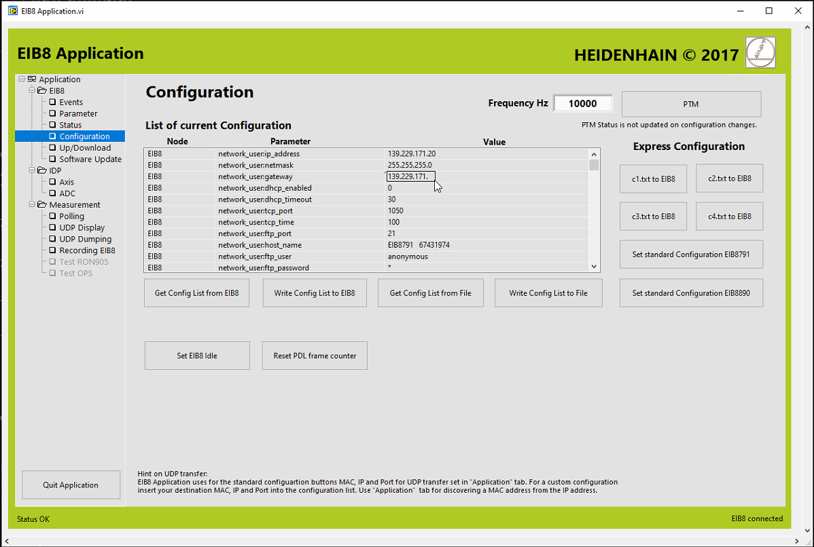
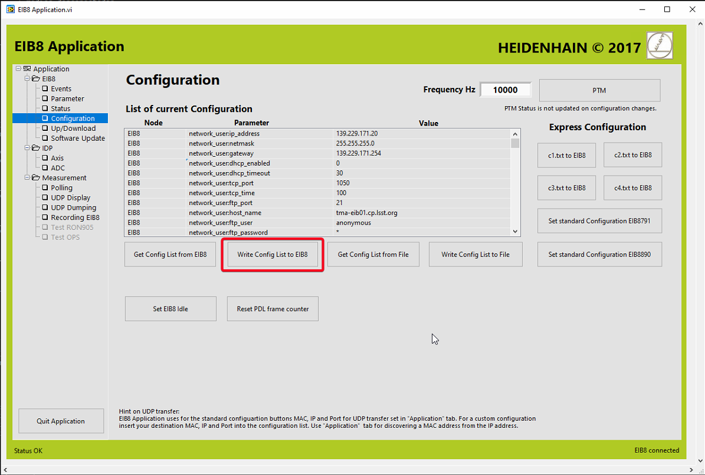
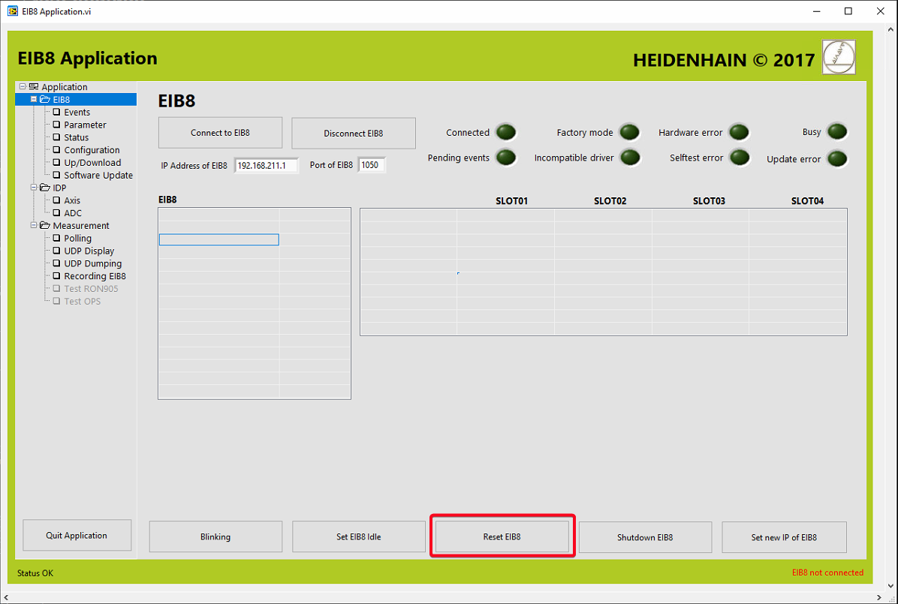

# EIB_ChangeIP

| **Requested by:** | **AURA** |
| --- | --- |
| **Doc. Code** | -- |
| **Editor:** | Alberto Izpizua |
| **Approved by:** | Julen García |

## Introduction

This document shows how to change the IP in the EIB.

## Changing EIB IP

To change the IP, there must be done two steps.

* Change the IP in the EIB itself
* Change the IP in the configuration file, otherwise the IP will return automatically to old IP when it is configured by the TMA PXI.

### Change the IP in the EIB

To change the IP in the EIB:

* Open the EIB tool "EIBApplication.exe" in a computer with access to the EIB network. This tools works on windows machines
* Connect to the EIB using the old IP

* Change the network parameters in the configuration window

* To change the configuration, just click in the Value of the Parameter that needs to be updated

* Write the configuration to the EIB

* Reset the EIB so that the new configuration takes effect.


### Change the IP in the configuration file

Go to the TMA PXI using ssh. Edit the file multi_ext.txt located in "/c/Configuration/EIB/" and change the next fields,
according the requirements for the communication and with the same data as in point [Change the IP in the EIB](#change-the-ip-in-the-eib).

```bash
EIB8;network_user:ip_address;192.168.211.1;
EIB8;network_user:gateway;192.168.211.253;
EIB8;network_user:tcp_port;1050;
EIB8;network_user:dhcp_enabled;0;
```

## Change the IP to sent UPD packets

To change the computer designated to receive UPD packets the IP and the mac of the host must be changed.

Find next field and insert the values for the host that it is going to ge the UPD packets.

```bash
# Setup UDP destination
EIB8;udp_transfer:udp_dest_mac;00.02.25.03.77.2a;        ;Set MAC address, where UDP packets of the EIB8 are sent to 
EIB8;udp_transfer:udp_dest_ip;192.168.211.11;            ;Set IP address, where UDP packets of the EIB8 are sent to 
EIB8;udp_transfer:udp_dest_port;3051;                    ;Set Port, where UDP packets of the EIB8 are sent to
```
